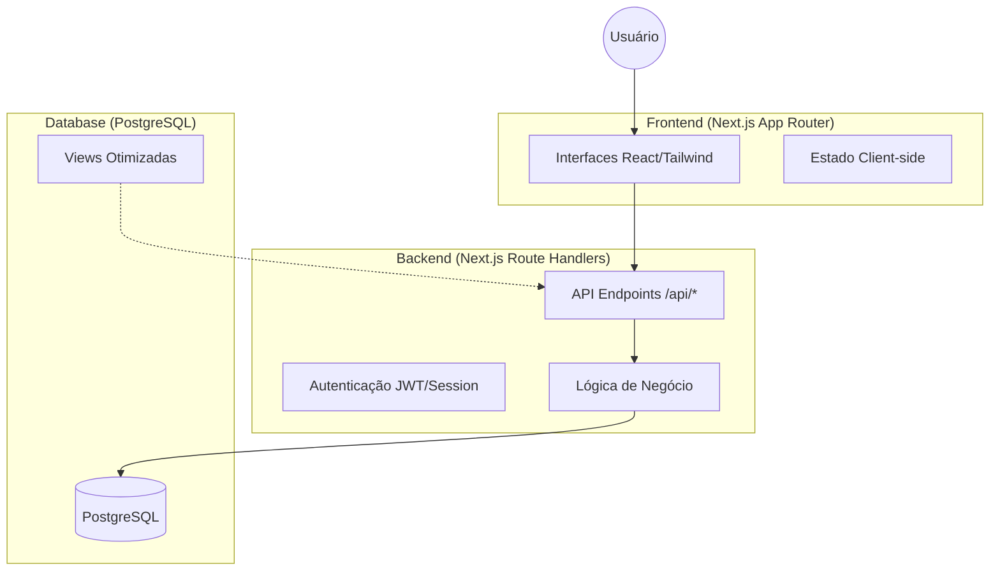

# Arquitetura Proposta - UaiBora

O UaiBora será estruturado como uma aplicação Fullstack moderna, utilizando o Next.js tanto para o Frontend quanto para o Backend (API Routes/Route Handlers), conectando-se a um banco de dados PostgreSQL.

## Visão Geral da Arquitetura

## Componentes Principais

### 1. Camada de Dados (PostgreSQL)
- **Tabelas Relacionais:** Para garantir integridade (usuários -> locais -> eventos).
- **Views:** Utilizadas para simplificar consultas complexas do feed, melhorando a performance e simplificando o código do frontend.
- **Geolocalização:** Uso de `latitude` e `longitude` para futuras funcionalidades de mapa e proximidade.

### 2. Camada de API (Next.js Route Handlers)
- **Diretório:** `app/api/`
- **Responsabilidade:** Validar dados, gerenciar autenticação e interagir com o PostgreSQL via um ORM (como Prisma ou Drizzle) ou consultas diretas.

### 3. Camada de Apresentação (React Server & Client Components)
- **Server Components:** Para carregar dados iniciais de forma rápida diretamente do banco/API.
- **Client Components:** Para interações dinâmicas (botões de interesse, formulários de sugestão, alternância de telas).

## Fluxo de Dados do MVP

1. **Sugestão de Local:** Usuário envia formulário -> API insere em `locais` com `status_aprovacao = 'pendente'`.
2. **Curadoria:** Admin altera status para `'aprovado'`.
3. **Feed Principal:** Frontend consome a View `vw_feed_descubra` que filtra apenas locais aprovados e eventos futuros.
4. **Interação:** Usuário clica em "Tenho Interesse" -> API registra em `interacoes_usuarios`.

Esta arquitetura permite que o projeto comece como um MVP enxuto, mas esteja pronto para escalar para geolocalização avançada e redes sociais de micro-comunidades.
