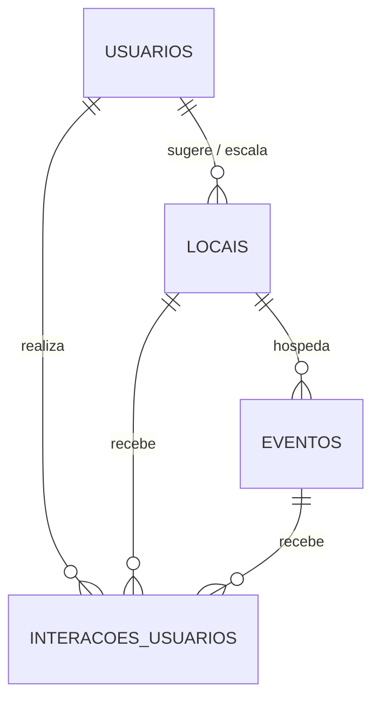

# Modelagem do Banco de Dados - UaiBora

Proposta de esquema para o banco de dados PostgreSQL, focado no MVP e na escalabilidade.

## Diagrama de Entidade-Relacionamento (Simplificado)



## Scripts DDL (PostgreSQL)

```sql
-- Extensão para UUID se necessário
CREATE EXTENSION IF NOT EXISTS "uuid-ossp";

-- 1. Tabela: usuarios
CREATE TYPE papel_usuario AS ENUM ('comum', 'proprietario', 'admin');

CREATE TABLE usuarios (
    id UUID PRIMARY KEY DEFAULT uuid_generate_v4(),
    nome VARCHAR(255) NOT NULL,
    email VARCHAR(255) UNIQUE NOT NULL,
    senha_hash VARCHAR(255) NOT NULL,
    perfil papel_usuario DEFAULT 'comum',
    criado_em TIMESTAMP WITH TIME ZONE DEFAULT CURRENT_TIMESTAMP
);

-- 2. Tabela: locais
CREATE TYPE status_local AS ENUM ('pendente', 'aprovado', 'rejeitado');

CREATE TABLE locais (
    id UUID PRIMARY KEY DEFAULT uuid_generate_v4(),
    nome VARCHAR(255) NOT NULL,
    descricao TEXT,
    categoria VARCHAR(100), -- Ex: 'Bar', 'Restaurante', 'Parque'
    latitude DECIMAL(9,6),
    longitude DECIMAL(9,6),
    status_aprovacao status_local DEFAULT 'pendente',
    sugerido_por_id UUID REFERENCES usuarios(id),
    proprietario_id UUID REFERENCES usuarios(id),
    criado_em TIMESTAMP WITH TIME ZONE DEFAULT CURRENT_TIMESTAMP
);

-- 3. Tabela: eventos
CREATE TABLE eventos (
    id UUID PRIMARY KEY DEFAULT uuid_generate_v4(),
    local_id UUID NOT NULL REFERENCES locais(id) ON DELETE CASCADE,
    titulo VARCHAR(255) NOT NULL,
    descricao TEXT,
    data_inicio TIMESTAMP WITH TIME ZONE NOT NULL,
    data_fim TIMESTAMP WITH TIME ZONE NOT NULL,
    criado_em TIMESTAMP WITH TIME ZONE DEFAULT CURRENT_TIMESTAMP
);

-- 4. Tabela: interacoes_usuarios
CREATE TYPE tipo_entidade AS ENUM ('local', 'evento');
CREATE TYPE tipo_interacao AS ENUM ('favoritou', 'tenho_interesse', 'check_in');

CREATE TABLE interacoes_usuarios (
    id UUID PRIMARY KEY DEFAULT uuid_generate_v4(),
    usuario_id UUID NOT NULL REFERENCES usuarios(id) ON DELETE CASCADE,
    entidade_id UUID NOT NULL, -- ID do local ou evento
    tipo_entidade_val tipo_entidade NOT NULL,
    tipo_interacao_val tipo_interacao NOT NULL,
    criado_em TIMESTAMP WITH TIME ZONE DEFAULT CURRENT_TIMESTAMP
);
```

## Views Otimizadas

### Feed Principal: `vw_feed_descubra`

Esta view consolida locais aprovados e seus respectivos eventos futuros para o feed de descoberta.

```sql
CREATE OR REPLACE VIEW vw_feed_descubra AS
SELECT 
    e.id AS evento_id,
    e.titulo AS evento_titulo,
    e.descricao AS evento_descricao,
    e.data_inicio,
    e.data_fim,
    l.id AS local_id,
    l.nome AS local_nome,
    l.categoria AS local_categoria,
    l.latitude,
    l.longitude,
    l.descricao AS local_descricao
FROM 
    eventos e
JOIN 
    locais l ON e.local_id = l.id
WHERE 
    l.status_aprovacao = 'aprovado' 
    AND e.data_fim >= CURRENT_TIMESTAMP
ORDER BY 
    e.data_inicio ASC;
```
